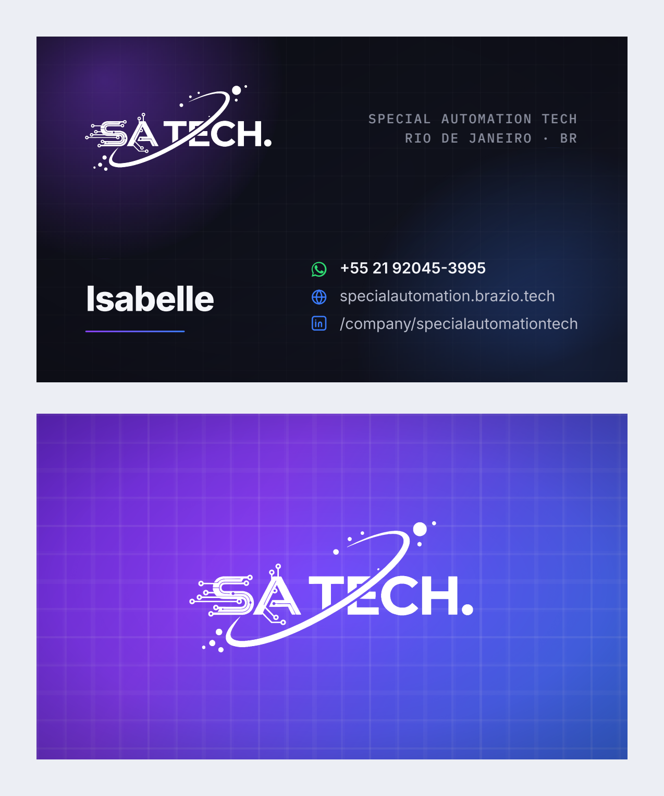

# Cartões de visita SA·TECH

Cartões de frente e verso para Isabelle, Marcelo e Iohana, com o logotipo oficial
da SA Tech sobre o fundo da landing page e do pôster do evento (gradiente
`#8b3ffb → #3b7bfb` sobre `#0d0e15`).

A logo usada é a **versão reversa (branca)** do logotipo oficial — a mesma que o
manual de marca (`../SA-Tech-Design-System.docx`, seção 2) prevê para fundos
escuros. Ela foi extraída da arte colorida do manual: o fundo claro virou
transparente e a tinta virou branca, preservando o traçado de circuito do símbolo,
a órbita e os pontos. O arquivo está em `logo-sa-tech-branca.png` (PNG com
transparência, 1054 × 483 px).

Regras do manual aplicadas:

- **Tamanho mínimo em impresso: 3 cm de largura.** Frente com 30 mm, verso com 46 mm.
- **Área de proteção** equivalente à altura da caixa alta do wordmark (4,1 mm na
  frente, 6,2 mm no verso): nenhum elemento nem a linha de corte invade essa folga.
- Reversa branca sobre fundo escuro/saturado — o manual proíbe a versão colorida
  sobre o gradiente saturado, que é o caso do verso.
- Sem sombra, contorno, distorção ou recolorização do gradiente do símbolo.



## Arquivos

| Arquivo | Para que serve |
| --- | --- |
| `sa-tech-cartoes-visita.pdf` | **É o que vai para a gráfica.** 6 páginas, pronto para impressão. |
| `cartao-visita.html` | Fonte editável. Fontes embutidas — abre igual em qualquer máquina, sem internet. |
| `gerar-pdf.py` | Regera o PDF e o `preview.png` a partir do HTML. |
| `preview.png` | Prévia da frente e do verso em 300 dpi. |
| `logo-sa-tech-branca.png` | Logo oficial na versão reversa (branca), com transparência. |

## Especificação para a gráfica

| Item | Valor |
| --- | --- |
| Formato final (corte) | 90 × 50 mm |
| Sangria | 3 mm por lado |
| Página do PDF | 96 × 56 mm (já com a sangria) |
| Área de segurança | 5 mm a partir da linha de corte |
| Páginas | 6 — pares frente/verso: 1‑2 Isabelle, 3‑4 Marcelo, 5‑6 Iohana |
| Cores | RGB (converter para CMYK no fluxo da gráfica) |
| Marcas de corte | Não incluídas — a arte já vem com sangria, a gráfica aplica o corte |

O verso é idêntico nos três cartões, então dá para fechar como **um verso único**
para toda a tiragem, se a gráfica cobrar por face.

### Dois pontos que valem avisar na hora do orçamento

- **Muita cobertura de tinta.** As duas faces são chapadas: frente escura e verso
  em gradiente vivo. Em impressão digital barata isso costuma dar marcas de
  rolete e banding no gradiente. Peça uma **prova impressa** antes de fechar a
  tiragem.
- **Acabamento.** Laminação fosca disfarça marcas de dedo no fundo escuro e é a
  escolha mais segura aqui. Verniz localizado no wordmark do verso fica muito
  bom, mas encarece.

Papel sugerido: couché fosco 300 g ou 350 g.

## Como editar

Abra `cartao-visita.html` num editor de texto. Cada cartão é um bloco
`<section class="card front">` comentado com o nome da pessoa. O que costuma mudar:

- **Nome** — `<div class="name">Isabelle</div>`
- **Telefone** — dentro de `<div class="contact wa">`
- **Cargo** — vem comentado. Descomente e escreva:
  ```html
  <div class="role">Cargo aqui</div>
  ```

Para adicionar uma quarta pessoa, copie um par frente/verso inteiro e troque nome
e telefone.

Abrir o HTML no navegador mostra a prévia com o tracejado de corte e de área
segura. **Não imprima direto do navegador para a gráfica** — a página do HTML tem
1 mm de folga proposital (o navegador arredonda a área imprimível para baixo e
comeria a sangria); quem tira essa folga é o `gerar-pdf.py`.

## Fontes

Inter (nomes e contatos) e IBM Plex Mono (as linhas em caixa alta), ambas sob a
SIL Open Font License — uso comercial e incorporação liberados. Vão embutidas em
base64 no HTML, então o arquivo abre igual em qualquer máquina e o PDF não
depende de nenhuma fonte instalada na gráfica.

## Pendências em relação ao manual de marca

O cartão nasceu antes do manual chegar e ainda diverge dele em dois pontos, que
valem uma decisão antes de mandar imprimir:

- **Paleta.** O cartão usa o roxo-azul da landing page e do pôster do evento
  (`#8b3ffb → #3b7bfb`). O manual define Azul SA Tech `#071C89` e Magenta SA Tech
  `#B910C3`, com gradiente de marca `#0B1B72 → #A31DBF`.
- **Tipografia.** O manual pede Poppins para títulos e Inter para texto. O cartão
  usa Inter e IBM Plex Mono — o mono não consta do manual.

## Regerar o PDF

```bash
pip install pypdf pypdfium2 pillow
python3 gerar-pdf.py
```

O script imprime o HTML pelo Chromium, recorta a página para 96 × 56 mm exatos e
confere, página por página, se a medida bate e se a sangria chega aos quatro
cantos. Se algo sair fora do esperado, ele falha com o motivo em vez de gerar um
PDF silenciosamente errado.
